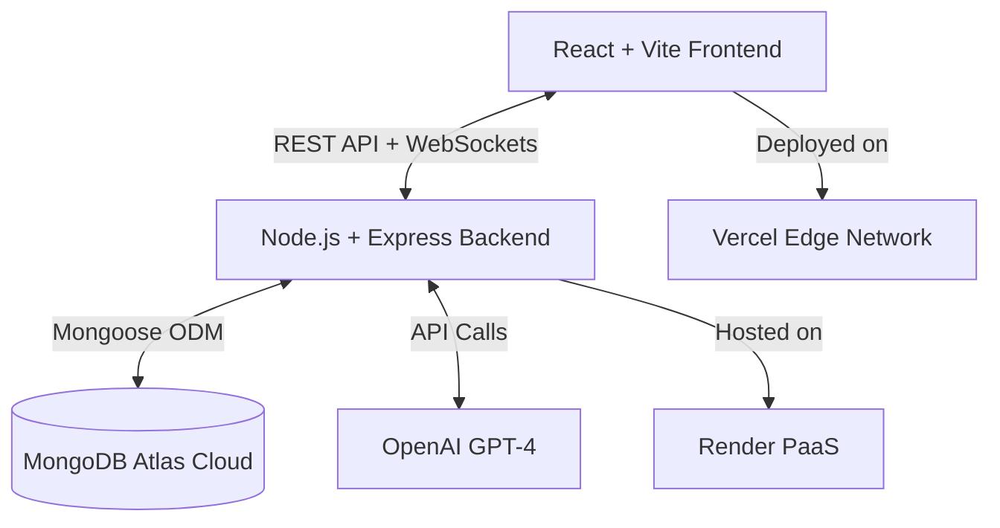

<div align="center">

# 🚀 TaskFlow AI - Intelligent Enterprise Workspace

[](https://task-flow-ai-self.vercel.app)
[]()
[]()

**A real-time, AI-driven Employee Management & Task Workflow platform.**

---

</div>

TaskFlow transforms traditional project tracking into a fluid, collaborative workspace. Engineered with the MERN stack and strictly adhering to modern system design principles, it features instantaneous real-time updates via WebSockets, AI-powered task contextualization, and role-based access control.

Designed from the ground up to demonstrate full-stack proficiency, distributed system handling, and seamless 3rd-party API integrations.

---

## ✨ Enterprise-Grade Features

### 🧠 AI-Powered Task Generation (OpenAI Integration)
Seamlessly integrates with GPT-4 to autonomously break down complex project directives. Submit a vague task title, and the AI automatically infers priority, categorizes the workload, and generates a structured, markdown-formatted sub-task checklist. 

### ⚡ Real-Time Collaborative Environment
Built on `Socket.io` for event-driven architecture. Every drag, drop, comment, and status change is broadcasted to all connected clients instantly. Achieves Google-Docs style live synchronization with zero polling overhead.

### 🔐 Multi-Tier Authorization & RBAC
Strict JSON Web Token (JWT) stateless authentication. Employs middleware-level route protection delineating `Admin` privileges (user approval, global analytics, project creation) from `Employee` execution boundaries. Includes a robust manual **Admin Approval Workflow** to prevent unauthorized access.

### 📊 Interactive Analytics Engine
Leverages `Recharts` to process and visualize unstructured MongoDB data into actionable insights. Features dynamic burndown charts, real-time status distributions, and employee workload histograms.

### 📂 Cloud-Ready Asset Management
Integrated `multer` processing pipelines for secure handling, validation, and storage of local attachments, preparing for seamless AWS S3/Cloudinary migrations.

---

## 🏗️ System Architecture & Tech Stack



### Frontend (Client-Side)
- **Framework:** React 18 & Vite
- **Styling:** Tailwind CSS, Framer Motion (Micro-interactions)
- **State & Data Fetching:** React Query (TanStack), Context API
- **Routing:** React Router v6
- **Visualizations:** Recharts, Lucide Icons
- **Drag & Drop:** `@hello-pangea/dnd`

### Backend (Server-Side)
- **Runtime:** Node.js
- **Framework:** Express.js
- **Database:** MongoDB Atlas (NoSQL) & Mongoose ODM
- **Real-time Engine:** Socket.io
- **Security:** bcryptjs (Password Hashing), JWT (Auth Tokens), CORS
- **Integrations:** OpenAI API

---

## 🎮 Live Demonstration

The application is deployed and fully accessible. Because the backend is hosted on a free cloud tier, **it may take ~50 seconds for the server to wake up** on your first click. 

🌐 **Live URL:** [https://task-flow-ai-self.vercel.app](https://task-flow-ai-self.vercel.app)

### Demo Access Controls
For convenience during evaluation, the platform includes pre-configured access portals. You can bypass the registration and approval workflow by clicking the **"Test as Admin"** or **"Test as Employee"** buttons on the login screen.

*Note: The platform is a single-tenant environment. Actions performed via the Demo Admin account are visible to all users currently evaluating the system.*

---

## 💻 Local Development Setup

If you wish to run the architecture locally for code review or contributions:

### Prerequisites
- Node.js (v18+)
- MongoDB Community Server (or an Atlas Cluster URI)
- OpenAI API Key (Optional)

### 1. Repository Initialization
```bash
git clone https://github.com/Omcodesk/Task-Assignment-Workflow-Management-System.git
cd Task-Assignment-Workflow-Management-System/ems
```

### 2. Backend Bootstrapping
```bash
cd backend
npm install

# Create environment configuration
cat << EOF > .env
NODE_ENV=development
PORT=5000
MONGO_URI=your_mongodb_connection_string
JWT_SECRET=super_secure_secret_token
OPENAI_API_KEY=your_openai_api_key
EOF

# Initialize Database with Seed Data
node seedDemo.js

# Start Development Server
npm run dev
```

### 3. Frontend Compilation
```bash
# Open a new terminal instance
cd ../
npm install
npm run dev
```
Navigate to `http://localhost:5173` to access the local client.

---

## 🤝 Contributing

Contributions, issues, and feature requests are welcome! Feel free to check the [issues page](https://github.com/Omcodesk/Task-Assignment-Workflow-Management-System/issues). Please refer to [CONTRIBUTING.md](CONTRIBUTING.md) for detailed guidelines.

## 📝 License

This project is open-sourced software licensed under the [MIT license](LICENSE).

---
<div align="center">
<b>Engineered by Om Chaddha</b><br>
<i>Software Developer | Full-Stack Engineer | AI/ML Enthusiast</i>
</div>
