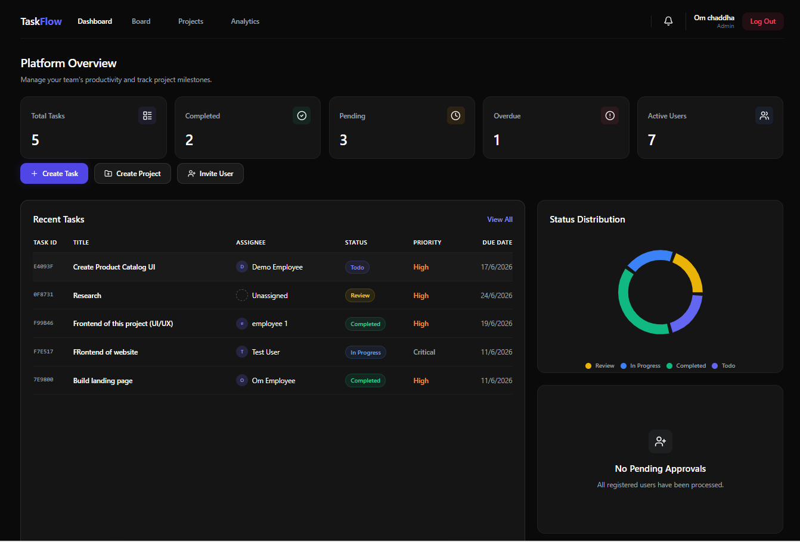
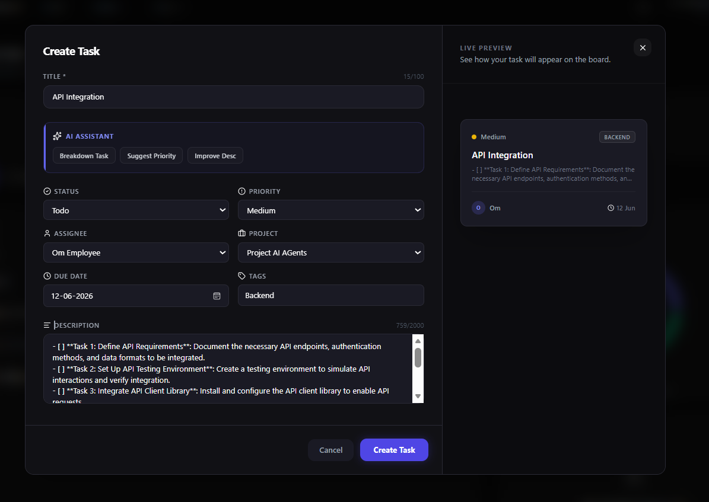
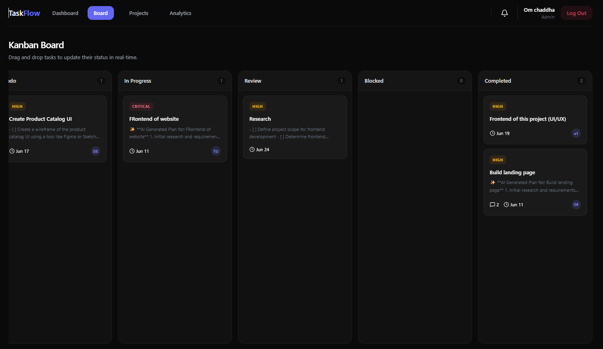
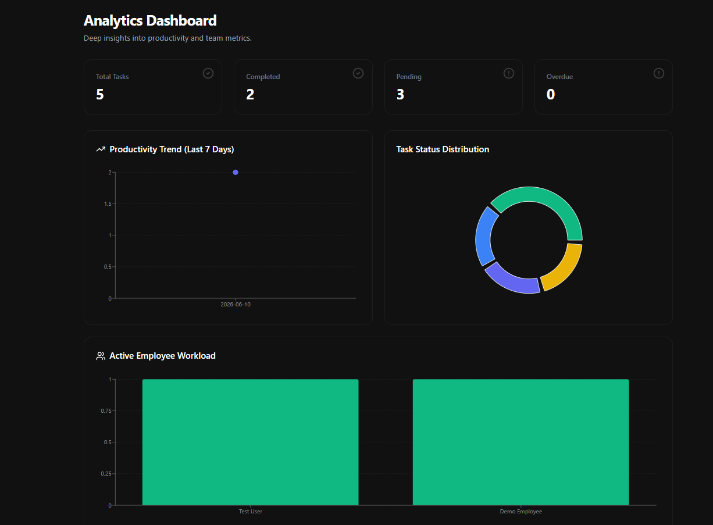
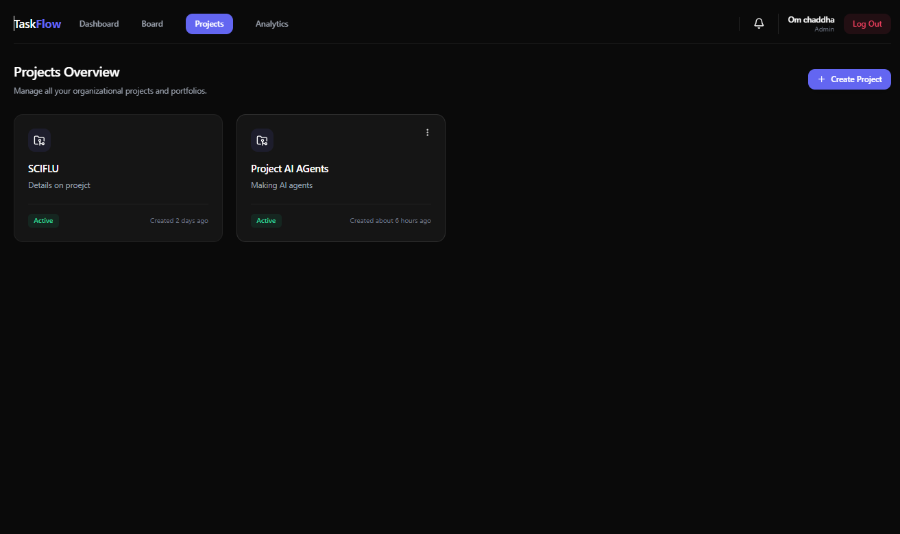
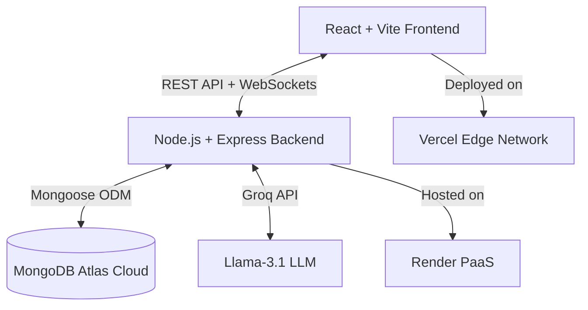

<div align="center">

# 🚀 TaskFlow AI

*A Full-Stack Project Management & Real-Time Kanban Platform powered by AI*

**Real-Time Collaboration · AI Task Contextualization · Role-Based Access Control**

[](https://task-flow-ai-self.vercel.app)
[]()
[]()
[]()
[]()

[]()
[]()
[]()
[]()
[]()

<br/>



🌐 [Live Demo](https://task-flow-ai-self.vercel.app) · 🐛 [Report Bug](https://github.com/Omcodesk/Task-Assignment-Workflow-Management-System/issues) · 💡 [Request Feature](https://github.com/Omcodesk/Task-Assignment-Workflow-Management-System/issues) · 📖 [Contributing](CONTRIBUTING.md)

</div>

---

## 📋 Table of Contents

- [Overview](#-overview)
- [Application Showcase](#-application-showcase)
- [Enterprise-Grade Features](#-enterprise-grade-features)
- [Technical Highlights](#-technical-highlights-for-recruiters--engineers)
- [System Architecture & Directory Structure](#️-system-architecture--directory-structure)
- [Live Demonstration](#-live-demonstration)
- [Local Development Setup](#-local-development-setup)

---

## 🔎 Overview

**TaskFlow AI** is a distributed, real-time employee and project management ecosystem designed to eliminate friction in modern agile workflows. Engineered with the **MERN stack** and designed for massive concurrency, it transforms static task lists into a living, breathing workspace.

By natively integrating **Llama-3 via the Groq API**, the platform autonomously acts as a virtual Project Manager—breaking down complex directives into actionable checklists, intelligently routing tasks, and automatically assigning priorities.

Designed from the ground up to demonstrate production-ready **Full-Stack proficiency**, event-driven architecture, **AI/ML API integration**, and seamless 3rd-party deployments across Vercel and Render.

---

## 📸 Application Showcase

### 🤖 AI-Powered Task Generation
Instead of managers spending hours writing tickets, the AI reads a 3-word title and instantly generates a highly-technical, markdown-formatted sub-task checklist. It also automatically infers priority.


### ⚡ Real-Time Drag-and-Drop Kanban Board
Built on WebSockets (`Socket.io`). When an admin drags a card across the board, the exact pixel-perfect update instantly reflects on all connected employee screens globally without any HTTP polling.


### 📈 Global Analytics & Metrics
Aggregating thousands of task data points from MongoDB into beautiful, interactive Recharts visualizations to track team velocity and workload distribution.


### 📂 Dynamic Project Workspaces
Strict JSON Web Token (JWT) stateless authentication delineates `Admin` privileges from `Employee` execution boundaries, ensuring data integrity across multiple active project environments.


---

## ✨ Enterprise-Grade Features

*   **Autonomous AI Task Orchestration:** Seamlessly integrates with the lightning-fast Groq API (Llama-3.1). Submit a vague task, and the AI automatically infers priority, categorizes the workload, and generates structured checklists.
*   **Zero-Latency WebSockets Synchronization:** Event-driven architecture replaces standard REST polling. Every drag, drop, and status change is broadcasted via a duplex `Socket.io` connection to all connected clients.
*   **Multi-Tier Authorization & RBAC:** Employs middleware-level route protection delineating `Admin` privileges (user approval, global analytics) from `Employee` execution boundaries. Includes a robust manual **Admin Approval Workflow** to prevent unauthorized registration.
*   **Interactive Analytics Engine:** Leverages `Recharts` to process unstructured NoSQL data into actionable insights, featuring dynamic burndown charts and real-time status distributions.

---

## 🏆 Technical Highlights (For Recruiters & Engineers)

As a Full-Stack Software Engineer, this project was architected to solve complex, real-world engineering challenges:

*   **Prompt Engineering & Deterministic AI:** Architected a custom API wrapper that enforces strict formatting outputs from LLMs. The AI acts as an autonomous PM, successfully converting ambiguous user inputs into 10-step actionable technical checklists with calculated priorities.
*   **Race-Condition Mitigation:** Overcame race conditions in React state management by decoupling local optimistic UI updates from the server-side WebSocket broadcasts, resulting in a butter-smooth drag-and-drop experience (`@hello-pangea/dnd`).
*   **Security & Data Integrity:** Implemented production-level security including JWT stateless authentication, `bcrypt` password hashing, strict CORS policies, environment variable encryption, and robust Mongoose Schema validation.
*   **Responsive UI/UX Engineering:** Built a complex, heavy-data React dashboard utilizing custom Tailwind CSS grids, Flexbox layouts, and Framer Motion micro-animations that remains entirely functional on mobile devices.

---

## 🏗️ System Architecture & Directory Structure

TaskFlow AI is a monorepo divided into a decoupled client and server to allow independent horizontal scaling.

```text
Task-Assignment-Workflow-Management-System/
├── ems/ (Client Application)
│   ├── src/
│   │   ├── api/          # Axios interceptors and centralized REST API calls
│   │   ├── components/   # Modular, reusable React components (Auth, Dashboard, Modals)
│   │   ├── context/      # React Context for global state (AuthContext, SocketContext)
│   │   └── utils/        # Helper functions and formatter utilities
│   ├── package.json      # Vite & React dependencies
│   └── tailwind.config.js# Custom design system tokens
│
└── ems/backend/ (Server Application)
    ├── controllers/      # Business logic (aiController, taskController, userController)
    ├── middleware/       # JWT verification, Role-based access checks, Error handling
    ├── models/           # Mongoose NoSQL Schemas (User, Task, Project)
    ├── routes/           # Express API route definitions
    ├── .env              # Encrypted secrets (Mongo URI, Groq API Key, JWT Secret)
    └── index.js          # Express server initialization and Socket.io mounting
```

### Flow Architecture


---

## 🎮 Live Demonstration

The application is fully deployed. Because the backend is hosted on a free cloud tier, **it may take ~50 seconds for the server to wake up** on your first click. 

🌐 **Live URL:** [https://task-flow-ai-self.vercel.app](https://task-flow-ai-self.vercel.app)

### Demo Access Controls
For convenience during evaluation, the platform includes pre-configured portals. Bypass the registration workflow by clicking the **"Test as Admin"** or **"Test as Employee"** buttons on the login screen.

---

## 💻 Local Development Setup

If you wish to run the architecture locally for code review:

### 1. Repository Initialization
```bash
git clone https://github.com/Omcodesk/Task-Assignment-Workflow-Management-System.git
cd Task-Assignment-Workflow-Management-System/ems
```

### 2. Backend Bootstrapping
```bash
cd backend
npm install

# Create environment configuration
cat << EOF > .env
NODE_ENV=development
PORT=5000
MONGO_URI=your_mongodb_connection_string
JWT_SECRET=super_secure_secret_token
GROQ_API_KEY=your_groq_llama3_key
EOF

# Initialize Database with Seed Data
node seedDemo.js

# Start Development Server
npm run dev
```

### 3. Frontend Compilation
```bash
# Open a new terminal instance
cd ../
npm install
npm run dev
```
Navigate to `http://localhost:5173`.

---
<div align="center">
<b>Engineered by Om Chaddha</b><br>
<i>Software Developer | Full-Stack Engineer | AI/ML Enthusiast</i>
</div>
